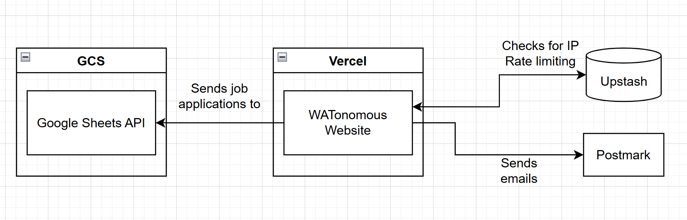

# The amazing WATonomous website for amazing people

- [The amazing WATonomous website for amazing people](#the-amazing-watonomous-website-for-amazing-people)
  - [How-Tos](#how-tos)
    - [Creating a Job Posting](#creating-a-job-posting)
    - [Creating a Blog Post](#creating-a-blog-post)
    - [Using Images in Markdown](#using-images-in-markdown)
    - [Adding New Members to the Member List](#adding-new-members-to-the-member-list)
  - [For developers](#for-developers)
    - [Setup](#setup)
    - [Architecture](#architecture)
    - [Environment Variables](#environment-variables)

WATonomous is proving that students can change the world of autonomous vehicles. If you are not a developer and would just like to add content to the site, feel free to skip the "For Developers" sections.

## How-Tos

### Creating a Job Posting

Job postings are simply markdown files in the `/static/job_postings` folder. Add a markdown file there and it'll automatically appear when the website is rebuilt.

The start of the file must include a metadata header. This will be a list fenced by three hyphens `---`.

Within the block a list with the following parameters **must be included**:

- **Title:** Job title, e.g. "Graphic Designer"

- **Team:** Main team name, e.g. "BizOps"

- **Subteam:** Subteam within main team, e.g. "Website"

- **Location:** Most likely either "Waterloo, ON", or "Remote"

- **Type:** Full Time, Part Time, Contract, etc.

Below is an example of a valid header.

```js
---
title: "Full Stack Developer"
team: "BizOps"
subteam: "Website"
location: "Waterloo, ON"
type: "Full Time"
---
```

After this header block, add all content you would like the applicant to see when they click on the posting. A description of WATonomous, responsibilities, key qualifications, etc.

Most common markdown syntax is supported, refer to the [documentation](https://www.markdownguide.org/basic-syntax/).

### Creating a Blog Post

Similar to a Job Posting, create a blog post by putting markdown in the `/static/blogs` folder.

Blog metadata is a little more involved. The following headers **must be present**:

- **title:** The name of the blog post
- **date:** The date the post was created, *please* have it in the format `MMMM DD YYYY`
- **image:** All posts must have an image associated with them. This will be the file path relative to the `public` folder. e.g. `/imgs/blog-01-image.png`
- **description:** A short blurb about the post. The user will see this before clicking to view the full thing
- **tags:** A *list* of tags you want associated with the post
- **authors:** A *list* the authors of the post. Even if there is one author place, place them in the list.
- **spotlight:** Our blog has a special spotlight i.e. *featured* section. `true` will place this post in it, and `false` will not.

Below is an example of a valid header:

```js
---
title: 'Don Quixote'
date: 'March 17 2023'
image: '/imgs/blog-01.png'
description: 'Lorem ipsum dolor sit amet, consectetur adipiscing elit, sed do eiusmod tempor incididunt ut labore et dolore magna aliqua. Nulla porttitor massa id neque aliquam vestibulum. Facilisis mauris sit amet massa vitae tortor.'
tags: ['tag1', 'tag2', 'tag3']
authors: ['Miguel de Cervantes']
spotlight: true
---
```

### Using Images in Markdown

If you ever need to place an image inside a markdown file, you follow this syntax:

```md

```

**Alt text** is important for accessibility. This is what screen readers will dictate when they come across an image. It is also the text that will display if the actual image itself cannot be displayed. Make this descriptive!

The **URL** can be in one of two formats. If using an image from the internet, simply place the image URL here, e.g.:

```md

```

If you have an image on your computer, first place your image in `public/imgs`. This is where *all* images on the website should be placed.

Then refer to the file name through its path including `public`. e.g.:

```md

```

### Adding New Members to the Member List

This is done in the `./pages/about.tsx` file. At the top of the file is a very large array of `MemberCardProps` objects called `MemberData`. Member order in the array will match that of the page.

To add a new member to the list just add a new `MemebrCardProps` object:

```js
{
    imageSrc: image_src,
    firstName: "Cloud",
    lastName: "Strife",
    description: "Cloud loves his Chocobo",
    position: "Party Leader",
}
```

> **Please note that we don't actually use the description field right now, feel free to leave it a blank string**

`imageSrc` should point to a statically imported image for best performance. Copy the imports at the top of the page. The format will be similar to this:

```js
import image_src from "../public/imgs/headshots/cloud_strife.jpg";
```

To keep things organized, images should be kept in the `headshots` folder.

## For developers

### Setup

This is a Next.js application written in Typescript, deployed with Vercel.

Set up the repo as you would any other node application:

```sh
npm i
npm run dev
```

`npm run build`, `npm run lint`, and `npm run pretty` are self explanatory.

### Architecture



We use the **GCS** Sheets API to make updates to our job posting sheets.

We use **Postmark** to send emails via the "Connect" modal.

Our anti-abuse system uses Upstash's managed redis.

### Environment Variables

We inject environment variables during our build step on Vercel: [https://vercel.com/watonomous-projects/wato-website-c9jr/settings/environment-variables](https://vercel.com/watonomous-projects/wato-website-c9jr/settings/environment-variables).

Access them in code using `process.env` just like a normal environment variable.

**UPSTASH_REDIS_REST_TOKEN**: Find this in the upstash console for the redis instance
**UPSTASH_REDIS_REST_URL**: Find this in the upstash console for the redis instance
**EMAIL_SERVER**: The token we use for our mail server
**ROLLING_ID**: The google sheet id for our rolling applications
**EXPEDITED_ID**: The google sheet id for our expedited applications
> The following keys can be found in the google cloud console in the WATO project
**CLIENT_ID**: OAuth 2 Client ID for our service account
**CLIENT_EMAIL**: Service account email
**PRIVATE_KEY**: Service account private key. This was generated when the key was created. Mint a new one in the service accounts page to change.
**PRIVATE_KEY_ID**: Private Key ID of the service account
**PROJECT_ID**: ID of the WATO project
