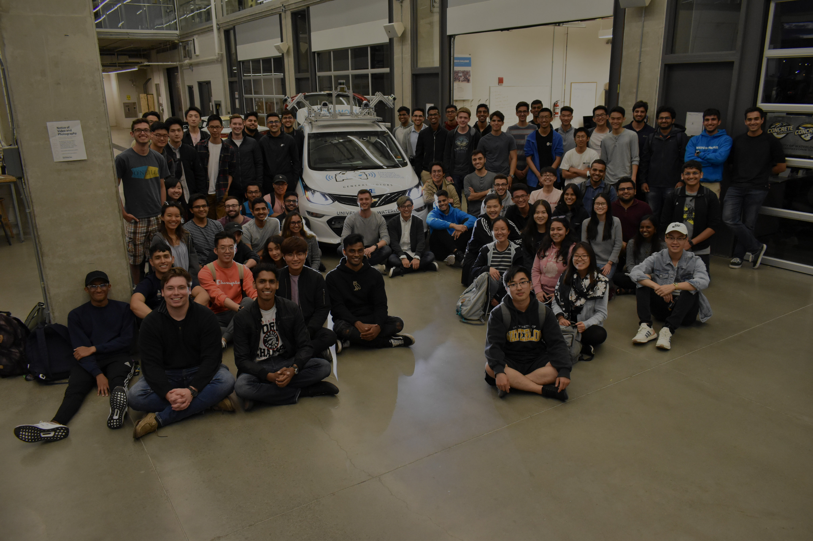

# WATO amazing website by amazing people
- [WATO amazing website by amazing people](#wato-amazing-website-by-amazing-people)
  - [Abstract](#abstract)
  - [For Developers](#for-developers)
  - [For Everyone Else](#for-everyone-else)
    - [Creating a New Job Posting](#creating-a-new-job-posting)
    - [Creating a New Blog Post](#creating-a-new-blog-post)
    - [Images](#images)

## Abstract

WATOnomous' new website initiative. Built with Next.js, Typescript and Tailwind. Deployed via Vercel.

Inquiries regarding the website or joining WATOnomous can be directed to [@kenzoengineer](https://github.com/kenzoengineer).

## For Developers

Clone the repo as you would normally. Run

```
npm i
```

in the root directory to install all required dependencies. Then run

```
npm run dev
```

to start a development server on `http://localhost:3000/`.

`npm run build` will build the repo as if it was being deployed.

`npm run lint` will run the linter.

`npm run pretty` will run the formatter on **all source files (!)**

## For Everyone Else

### Creating a New Job Posting

Creating a new job posting is as simple as creating a markdown (`.md`) file.

If you know how to use Github, feel free to open a pull request and tag a developer. If you don't know how to use Github, or would prefer to do this with the guidance of a developer, let one of us know in the discord and we would be happy to help.

A markdown file is simply a plain text file, with special characters to format text. Creating a markdown file can be done by renaming a standard `.txt` file.

Place the markdown document in `/static/job_postings`. The name of the file will *not* be the title of the posting, rather it will be what is displayed in the URL.

> e.g. A file named `posting-01.md` will display as `watonomous.ca/careers/posting-01`

The start of the file must include a metadata header. This will be a list fenced by three hyphens `---`.

Within the block a list with the following parameters **must be included**:

- **Title:** Job title, e.g. "Graphic Designer"

- **Team:** Main team name, e.g. "BizOps"

- **Subteam:** Subteam within main team, e.g. "Website"

- **Location:** Most likely either "Waterloo, ON", or "Remote"

- **Type:** Full Time, Part Time, Contract, etc.

Below is an example of a valid header.

```js
---
title: "Full Stack Developer"
team: "BizOps"
subteam: "Website"
location: "Waterloo, ON"
type: "Full Time"
---
```

After this header block, add all content you would like the applicant to see when they click on the posting. A description of WATOnomous, responsibilities, key qualifications, etc. Someone should make a standard template...

If you aren't fluent in markdown, don't be afraid! It is very easy. There are many great guides [online](https://www.markdownguide.org/basic-syntax/)

> Our website may not support every single piece of syntax, however, everything I would expect in a job posting (headers, lists, images) work as intended.

### Creating a New Blog Post

Blog posts also use markdown. For brevity I will not reiterate creating a markdown file or what the format of a header should be like. Refer to the above section [Creating a New Job Posting](#creating-a-new-job-posting) if you ever get lost.

Posts will be placed in `/static/blogs`. Again, feel free to open a pull request to do this, otherwise contact a developer on discord.

Again, the name of the file will *not* be the title of the post, rather it will be what is displayed in the URL.

> e.g. A file named `blog-01.md` will display as `watonomous.ca/blogs/blog-01`


- Create a markdown document in `/job_postings`, titled anything
- Write a metadata section by fencing some text with `---`. Inside write the job title and team. Follow the headers and format exactly or it won't work.

Blog metadata is a little more involved. Take a look at the example if you are confused. The following headers **must be present**:

- **title:** The name of the blog post
- **date:** The date the post was created, *please* have it in the format `MMMM DD YYYY`
- **image:** All posts must have an image associated with them. This will be the file path relative to the `public` folder. e.g. `/imgs/blog-01-image.png`
- **description:** A short blurb about the post. The user will see this before clicking to view the full thing
- **tags:** A *list* of tags you want associated with the post
- **authors:** A *list* the authors of the post. Even if there is one author place, place them in the list.
- **spotlight:** Our blog has a special spotlight i.e. *featured* section. `true` will place this post in it, and `false` will not.

Below is an example of a valid header:

```js
---
title: 'Don Quixote'
date: 'March 17 2023'
image: '/imgs/blog-01.png'
description: 'Lorem ipsum dolor sit amet, consectetur adipiscing elit, sed do eiusmod tempor incididunt ut labore et dolore magna aliqua. Nulla porttitor massa id neque aliquam vestibulum. Facilisis mauris sit amet massa vitae tortor.'
tags: ['tag1', 'tag2', 'tag3']
authors: ['Miguel de Cervantes']
spotlight: true
---
```

### Images

If you ever need to place an image inside a markdown file, you follow this syntax:

```md

```

**Alt text** is important for accessibility. This is what screen readers will dictate when they come across an image. It is also the text that will display if the actual image itself cannot be displayed. Make this descriptive!

The **URL** can be in one of two formats. If using an image from the internet, simply place the image URL here, e.g.:

```md

```

If you have an image on your computer, first place your image in `public/imgs`. This is where *all* images on the website should be placed.

Then refer to the file name through its path including `public`. e.g.:

```md

```